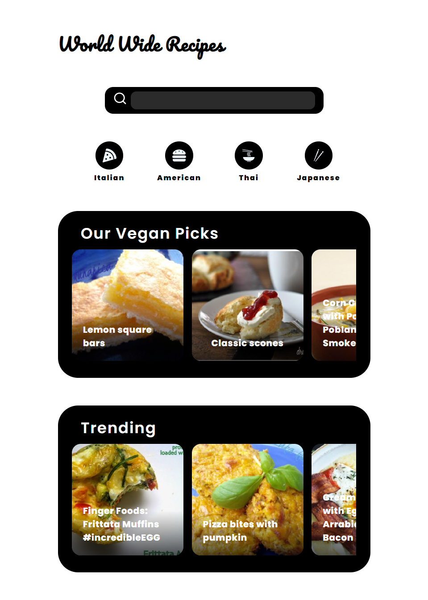
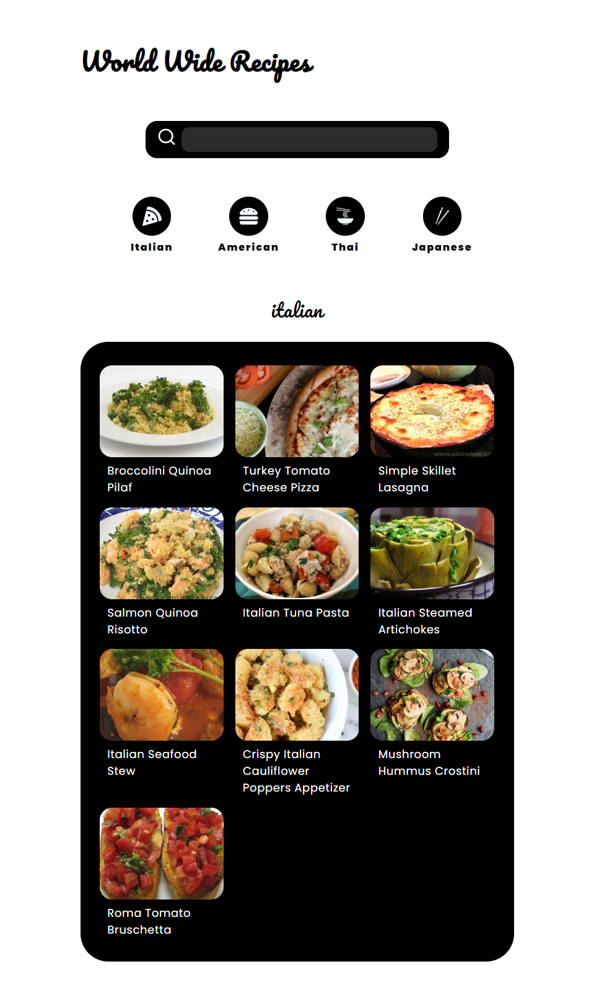
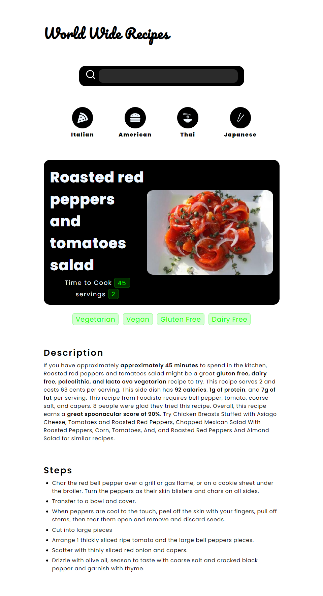

# Recipe App

A recipe is a formula of ingredients and a list of instructions for creating prepared foods. It is used to control quality, quantity, and food costs in a food services operation. A recipe may be simple to complex based on the requirements of the operation and the intended user. For example, an experienced chef may need a recipe with only a few details, while a beginner cook may need more information about ingredients, preparation steps, cooking times and temperatures, visual cues, and equipment requirements.

## Features

1. Search
2. categories
3. Dynamic landing page
4. Trending section
5. recommend section
6. persist data from api in local Storage
7. Routing and Navigation

## React Tools

1. CRA
2. React Hooks {useEffect, useState}
3. React Routing {BrowserRouting, NavLink, Link, Routes, useLocation, useParams }
4. React Icons

## App Views

1. Home Page
2. Cuisine Page
3. Recipe Page

## Components

1. Carousel View
2. grid view
3. navigation bar
4. category bar
5. Search Bar
6. Recipe Hero Section


### Web Page

<div align="center">
<h3> Recipe App Home Page </h3>

</div>

<table align="center">
  <tr>
    <td align="center"><h3>Cuisine Page View</h3></td>
     <td align="center"><h3>Recipe Hero View</h3></td>
  </tr>
  <tr>
    <td align="center"></td>
    <td align="center"></td>
  </tr>
 </table>

## Api

### The Spoonacular Api

```html
https://api.spoonacular.com/recipes/
```

## Fonts

Google fonts are used in this project

1. Poppins
2. Pacifico

```html
<!-- Fonts -->
<link rel="preconnect" href="https://fonts.googleapis.com" />
<link rel="preconnect" href="https://fonts.gstatic.com" crossorigin />
<link
  href="https://fonts.googleapis.com/css2?family=Pacifico&family=Poppins:ital,wght@0,200;0,400;0,600;0,800;0,900;1,200;1,400;1,600;1,800;1,900&display=swap"
  rel="stylesheet"
/>
```
