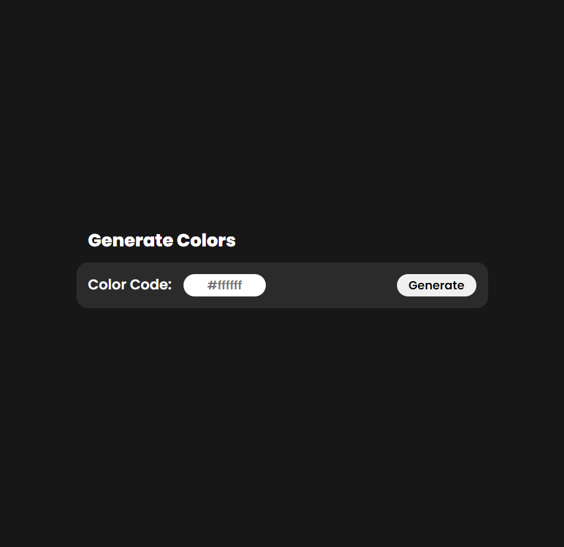
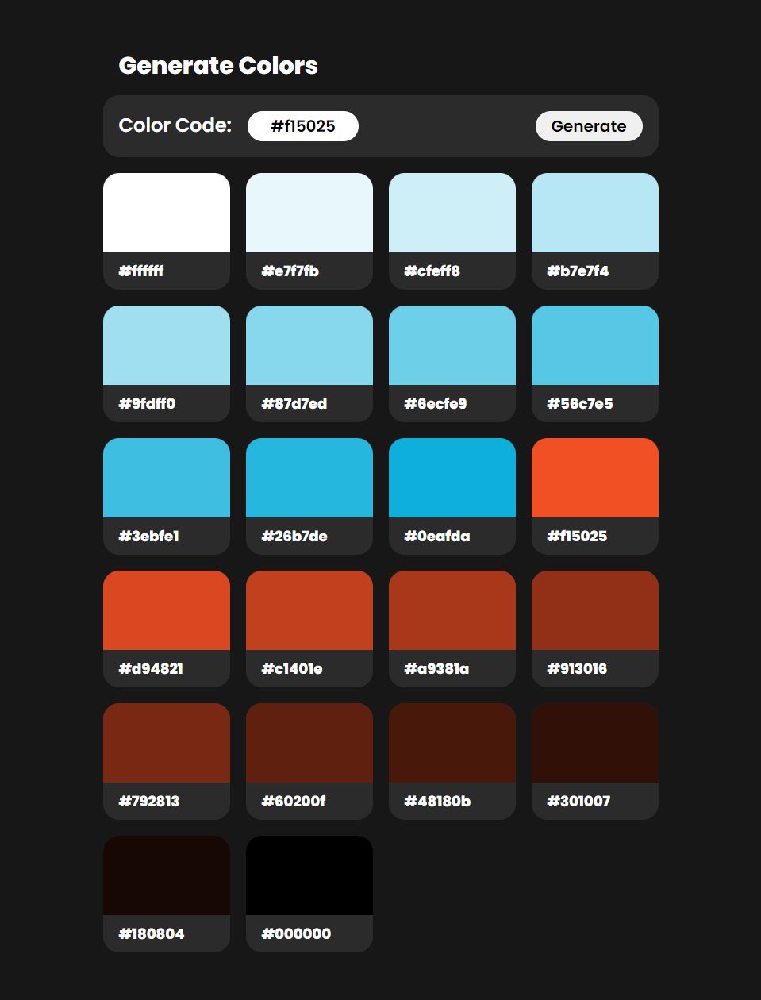

# Color Generator

### React App
Enter a hex color code and a palette will be generated.

A color palette is a combination of colors used by UI designers when designing an interface. When used correctly, color palettes form the visual foundation of your brand, help to maintain consistency, and make your user interface aesthetically pleasing and enjoyable to use.

### App Components

1. Generative Card
2. Pure Css
3. React Use State Hook
4. Navigation Bar


### Web Page

<div align="center">


</div>

### Color Pallet

``` CSS
:root {
    --bg-color: #171717;
    --white: #fff;
    --card-bg: #2b2b2b;
}

```

