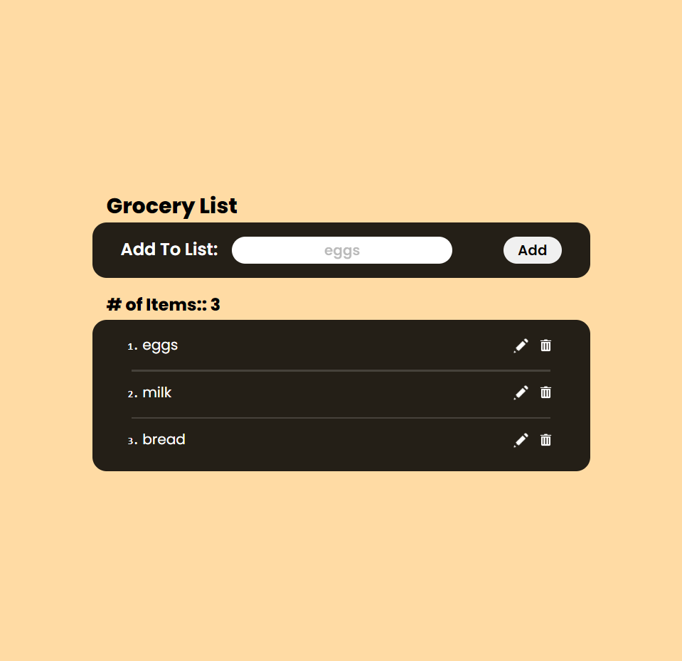
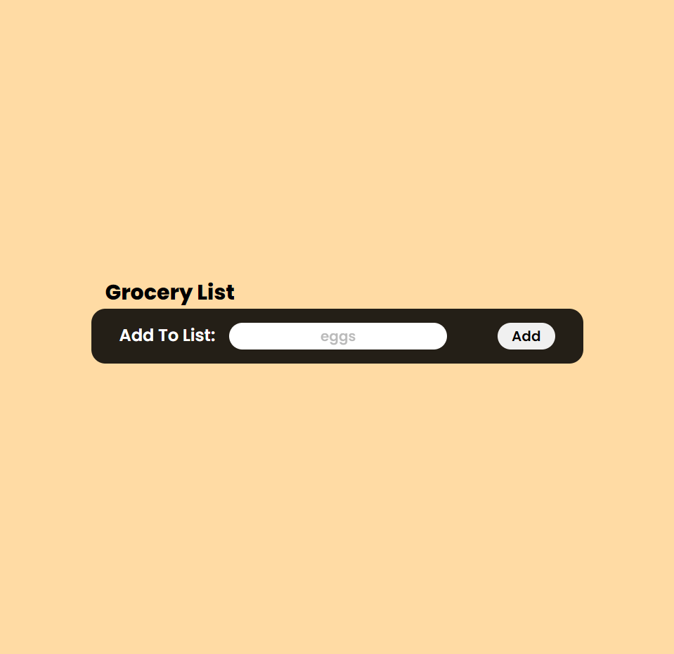
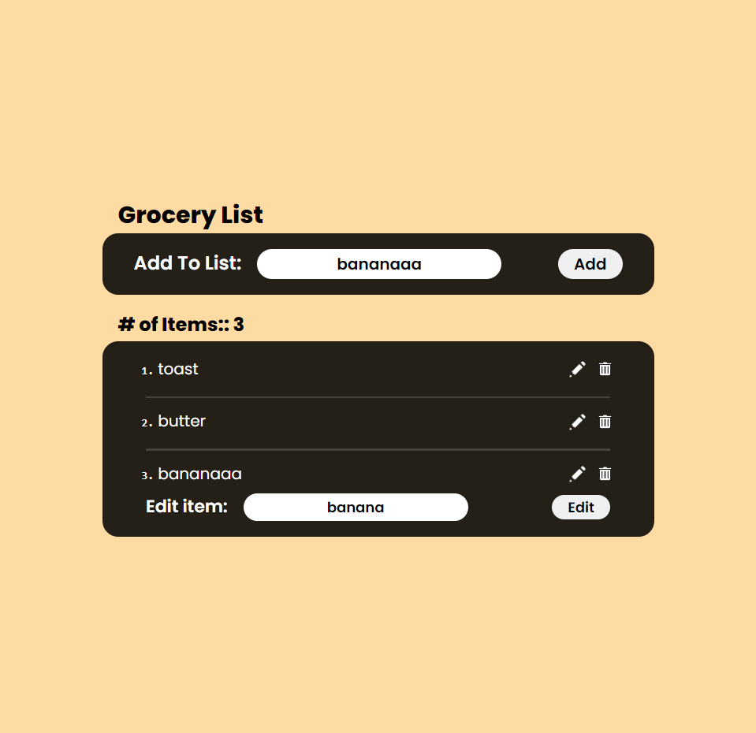

# Grocery List

### React App

An app that helps you remember the items to shop for, even if you've left or lost your list on the way to the store.

## App Feature

1. Use React 18
2. Pure Css
3. Add items
4. delete Items
5. Edit Item
6. Read and write to local storage

### App Components

1. Generative Card
2. React Use State Hook
3. Input Bar
4. Edit Bar
5. Local Storage Api

### Web Page

<div align="center">
<h3> Grocery List Webpage View </h3>

</div>

<table align="center">
  <tr>
    <td align="center"><h3>Empty Grocery List Webpage View</h3></td>
     <td align="center"><h3>Edit Grocery List Webpage View</h3></td>
  </tr>
  <tr>
    <td align="center"></td>
    <td align="center"></td>
  </tr>
 </table>

### Color Pallet

```CSS
:root {
    --yellow: #FFDBA4;
    --card-bg: rgba(0, 0, 0, 0.859);
    --white: #fff;
}

```

### Fonts

```html
<!-- Fonts Poppins -->
<link rel="preconnect" href="https://fonts.googleapis.com" />
<link rel="preconnect" href="https://fonts.gstatic.com" crossorigin />
<link
  href="https://fonts.googleapis.com/css2?family=Poppins:ital,wght@0,200;0,400;0,600;0,800;0,900;1,200;1,400;1,600;1,800;1,900&display=swap"
  rel="stylesheet"
/>
```
