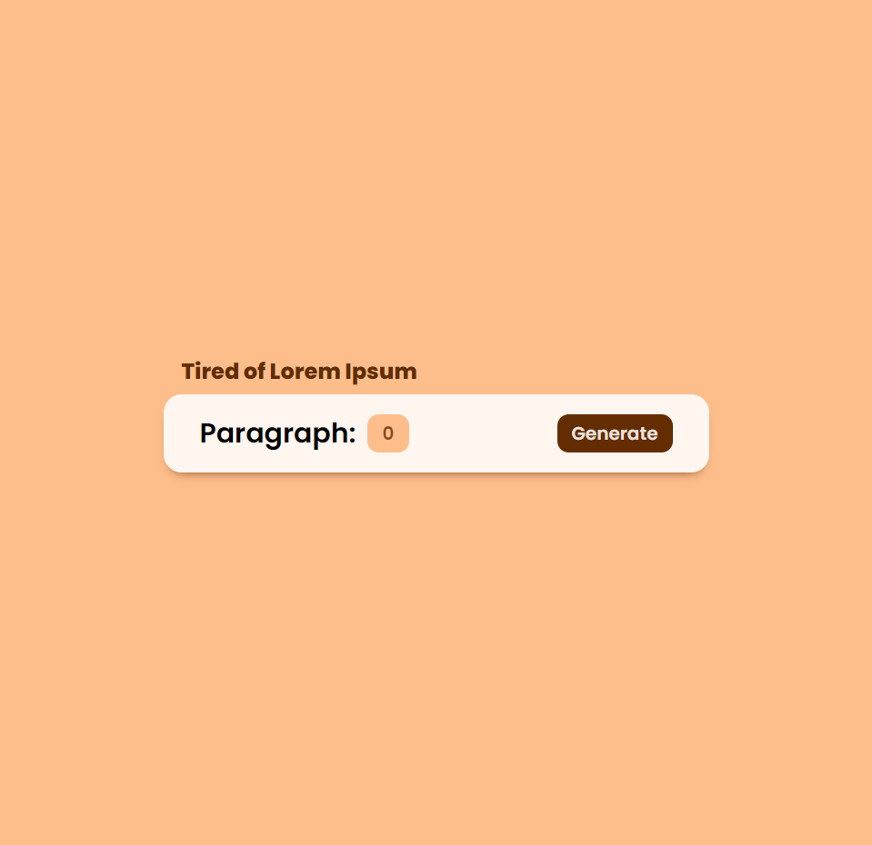
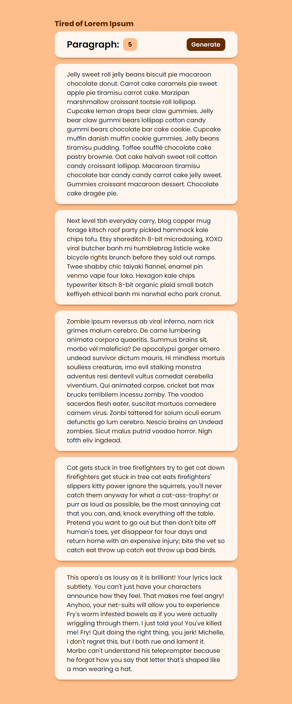
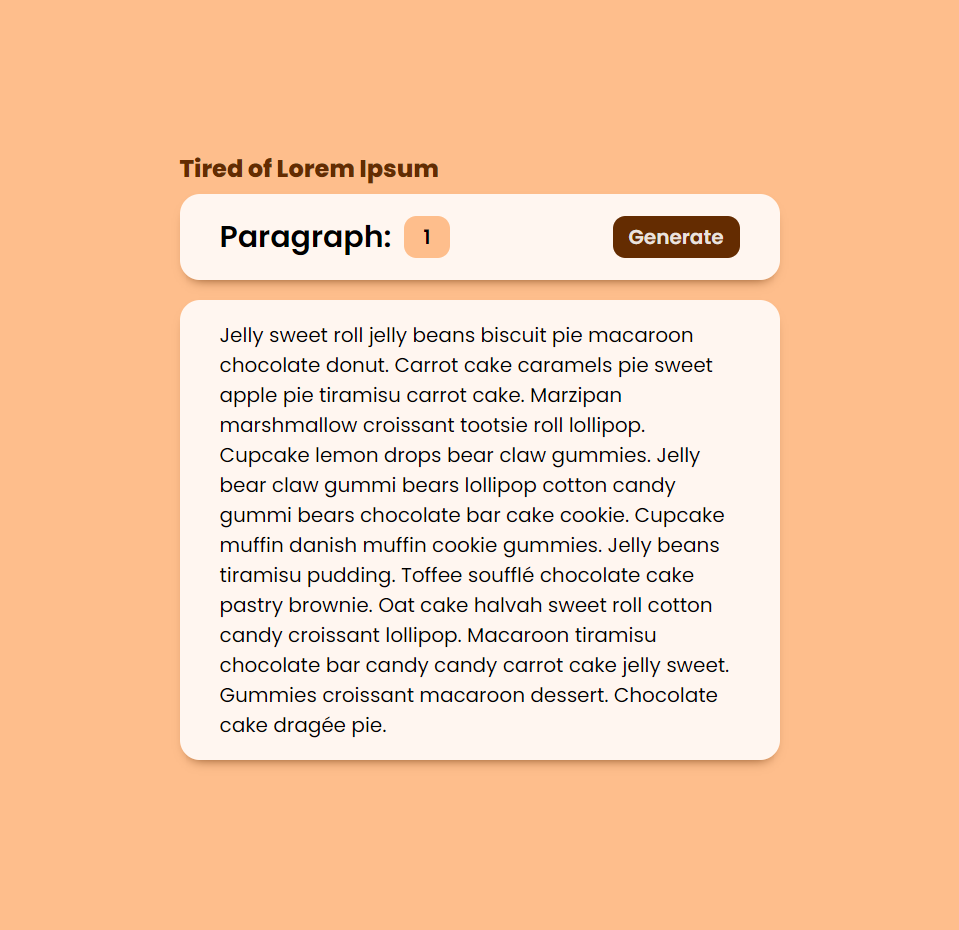

# Random Paragraph Generator

### React App
A web application that generates random text that you can use in sample web pages or typography samples.

### App Components

1. Generative Card
2. Pure Css
3. React Use State Hook

### Web Page

<div align="center">



</div>

### Color Pallet

```CSS
:root {
    --white: #fffd;
    --orange: #FEBE8C;
    --shadow: #642c01;
}
```
